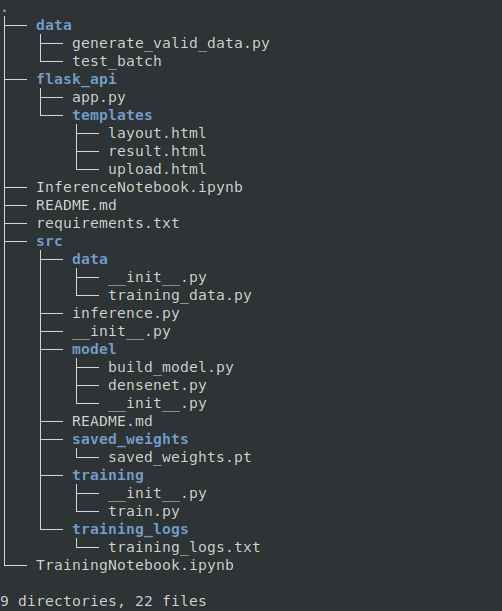

# Flask Image Classification

This repo comprises of Inference part of Inception, InceptionV3 on cifar10 using Flask for Model serving.

The directory is defined as 




## Setting up the Environment

Create a Folder named "Inception"

To setup the environment 
```bash
python3 -m pip install -U virtualenv # install the virtualenv
virtualenv -p python3 dev_env # creating an environment
source dev_env/bin/activate # activate environment
git clone https://github.com/myuvarajmp/Inception-CIFAR10 #clone the repo
cd Inception
pip install -r requirements.txt # install the requirements
```


## Model Serving on Flask.

For Serving this model as a website. First generate  test images by executing above commands and then.


For Infering using Inception V1 model, change the model no. in flask_api/app.py line 53 to 1.
For Infering using Inception V3 model, change the model no. in flask_api/app.py line 53 to 2.

```bash
python flask_api/app.py
```


